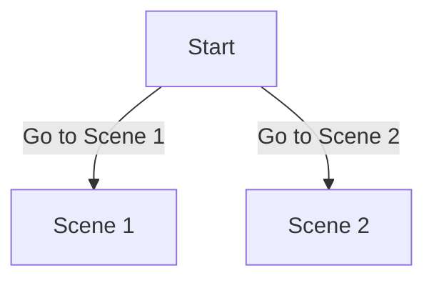

# Scene Flow Generator

This directory contains `generate-scene-flow.js`, a utility script that automatically analyzes all scene definitions and generates comprehensive documentation of scene flow and connections.

## Purpose

The scene flow generator creates `docs/SCENE_FLOW.md`, which provides:

- **Scene Connection Matrix** - A table showing which scenes connect to which others
- **Scene Flow Details** - A detailed breakdown of each scene's available choices and their destinations
- **Mermaid Diagram** - A visual flowchart of the entire story structure
- **Statistics** - Summary counts of total scenes, choices, and conditional outcomes

This documentation serves as a single source of truth for understanding how your story flows, making it easy for future authors to:
- See the current state of all scene connections at a glance
- Identify gaps in the story flow
- Plan new scenes and how they fit into existing paths
- Understand which scenes are entry points vs. dead-ends

## Usage

### Generate or Update Documentation

After adding or modifying scenes, run:

```bash
node src/scenes/generate-scene-flow.js
```

The script will:
1. Scan all scene files in the `src/scenes/` directory
2. Parse each scene's choices and outcomes
3. Extract scene IDs, choice text, and destination scene IDs
4. Generate `docs/SCENE_FLOW.md` with full documentation

### Example Output

The generated `SCENE_FLOW.md` includes:

```markdown
## Scene Connection Matrix

| From \ To | scene1 | scene2 | scene3 |
|-----------|--------|--------|--------|
| start     | ✓      |        | ✓      |
| scene1    |        | ✓      |        |
```

And a Mermaid diagram:



## How It Works

### Scene Parsing

The script uses regex patterns to extract:
- **Scene ID** - From the `id: 'xxx'` field
- **Choices** - All objects in the `choices: [...]` array
- **Destinations** - From either:
  - Direct `next: 'xxx'` property
  - Conditional `outcomes: [{ next: 'xxx' }, ...]` array

### Scene Structure Requirements

For the parser to work correctly, scenes must follow this structure:

```typescript
export const MyScene: Scene = {
  id: 'my_scene',
  text: '...',
  choices: [
    {
      id: 'choice-1',
      text: 'Choice text',
      next: 'destination_scene'
    },
    {
      id: 'choice-2',
      text: 'Another choice',
      outcomes: [
        { conditions: {...}, next: 'dest1' },
        { next: 'dest2' }  // fallback
      ]
    }
  ]
};
```

## Script Details

### Input
- All `.ts` scene files in `src/scenes/` and subdirectories
- Excludes: `node_modules/`, dotfiles, `examples/` directory

### Output
- **File:** `docs/SCENE_FLOW.md`
- **Format:** Markdown with embedded Mermaid diagram
- **Size:** ~5-15 KB depending on number of scenes and connections

### Generated Sections

1. **Header & Metadata** - Last updated timestamp, scene count
2. **Table of Contents** - Links to major sections
3. **Connection Matrix** - Table showing all scene connections
4. **Flow Details** - Scenes grouped by category with choice breakdowns
5. **Mermaid Diagram** - Visual graph of story flows
6. **Statistics** - Summary metrics

## Workflow for Authors

1. **Create or modify scenes** - Add new scene files or update choices in existing scenes
2. **Test locally** - Run the app and verify scenes work
3. **Generate documentation** - Run `node src/scenes/generate-scene-flow.js`
4. **Review SCENE_FLOW.md** - Check that connections look correct
5. **Commit** - Include both scene changes and updated SCENE_FLOW.md in your commit

## Troubleshooting

### Script shows "0 choices"

This usually means the scene structure doesn't match the expected format. Ensure:
- Choices are wrapped in a `choices: [...]` array
- Each choice has `id` and `text` properties
- Destinations are specified via `next: 'xxx'` or `outcomes: [{next: 'xxx'}]`

### Some scenes not parsing

Check for:
- Syntax errors in the scene file
- Inconsistent quote usage (mix of single/double quotes can cause issues)
- Missing closing braces or parentheses

Run the script with verbose output to see which files have issues:
```bash
node src/scenes/generate-scene-flow.js 2>&1 | grep -i warning
```

## Automation

### Auto-generate on commit (future)

You could add a git hook to automatically generate the flow documentation:

```bash
# .git/hooks/pre-commit
#!/bin/sh
node src/scenes/generate-scene-flow.js
git add docs/SCENE_FLOW.md
```

### Integrate into build process

Add to `package.json` if you want automatic generation:

```json
{
  "scripts": {
    "build": "npm run generate:flow && vite build",
    "generate:flow": "node src/scenes/generate-scene-flow.js"
  }
}
```

## References

- **Generated Documentation:** See `docs/SCENE_FLOW.md` for the current scene flow
- **Scene Organization:** See `README.md` in this directory for scene categorization
- **Scene Implementation:** Each scene file in the subdirectories (exploration/, town/, quests/, special/)
